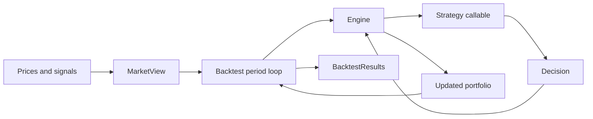

# backtest-lib

[](https://pypi.org/project/backtest-lib/)
[](https://github.com/jathoms/backtest-lib/actions/workflows/unit-tests.yml/badge.svg)
[](https://pypi.org/project/backtest-lib/)

Find the full reference docs [here](https://jathoms.github.io/backtest-lib)

## Developer setup

The package supports Python 3.12 and newer. CI and the manual review guide use
Python 3.14. Building the editable package also requires the stable Rust
toolchain because the project includes a small Maturin extension.

From PowerShell at the repository root, confirm the tools and create the locked
development environment:

```powershell
python --version
uv --version
rustc --version
just --version
uv sync --group dev --group docs --frozen
.\.venv\Scripts\python.exe --version
```

Run a fast end-to-end check before exploring the code:

```powershell
uv run pytest tests/e2e/test_stockfit_demo.py -q
uv run python -m examples.stockfit.demo --output-dir artifacts/stockfit-review
```

Both commands are offline and use invented fixtures. A StockFit token is not
needed for development or for the manual review.

For VS Code, open the repository folder, select
`.venv\Scripts\python.exe` with **Python: Select Interpreter**, and follow the
[manual code-review guide](docs/stockfit/learning-guide.md) to install the local
debug configurations.

## Architecture at a glance



`MarketView` time-fences the data visible at each period. `Backtest` passes that
view to the engine, which calls the strategy. The strategy returns a declarative
`Decision`; the engine turns it into an execution plan and updated portfolio.
`Backtest` coordinates the period loop and materialises the result history.

### Repository map

```text
src/backtest_lib/        Core market, strategy, engine, portfolio and backtest code
examples/stockfit/       Offline-first StockFit adapter and research workflow
tests/unit/              Focused behavioural tests for individual components
tests/e2e/               Complete workflow and lookahead-safety tests
docs/source/             Sphinx reference documentation
docs/stockfit/           Methodology, evidence and manual learning material
rust/                    Native universe-mapping extension built by Maturin
```

To understand the code rather than only run it, follow the
[manual code-review guide](docs/stockfit/learning-guide.md). It traces one
synthetic fact through the StockFit adapter, point-in-time transforms,
strategy, backtest engine and derived outputs.

## Usage

### Quickstart

Below is an example of a buy-and-hold strategy uniform over the entire universe specified by the data in `spot_prices.csv`.

```python
import polars as pl

import backtest_lib as btl

prices = pl.read_csv("docs/assets/data/spot_prices.csv")
market = btl.MarketView(prices)

initial_portfolio = btl.uniform_portfolio(market.securities, value=1_000_000)


def buy_and_hold(universe, current_portfolio, market, ctx):
    return btl.hold()


backtest = btl.Backtest(
    strategy=buy_and_hold,
    market_view=market,
    initial_portfolio=initial_portfolio,
)
results = backtest.run()

print("total return:", results.total_return)

results.values_held.plot().properties(width=1000, height=600)
```
Output: 

### StockFit point-in-time example

An offline-first example shows how to adapt StockFit-shaped prices and annual
filings into point-in-time signals, compare a fundamental ranking with an
equal-weight portfolio, and keep live provider data opt-in. See the
[StockFit example guide](docs/stockfit/README.md).

### Strategy

This library provides a lightweight framework for backtesting trading strategies. At its core, you define a strategy as a simple Python function that maps the current market state and portfolio into a decision about what to hold next. The library handles the rest: simulating trades over time, applying your decision rules at an optionally specified frequency, and generating performance statistics.

A strategy is any callable that returns a `Decision`:

```python
Strategy = Callable[..., Decision]
```

Inputs are injected by parameter name (pytest-fixture style). Your strategy can request any subset of:

- `universe`: `tuple[str, ...]`
- `current_portfolio`: `backtest_lib.portfolio.Portfolio`
- `market`: `backtest_lib.market.MarketView`
- `ctx`: `backtest_lib.strategy.context.StrategyContext`

At each decision point in the decision schedule, your strategy returns one `Decision` object.

Examples:

```python
from backtest_lib import hold, target_weights


def equal_weight_strategy(universe):
    return target_weights({sec: 1 / len(universe) for sec in universe})


def buy_and_hold_strategy():
    return hold()


def monthly_rebalance(universe, market, ctx):
    if ctx.now.day != 1 or len(market.prices.close.by_period) < 21:
        return hold()
    latest = market.prices.close.by_period[-1]
    month_ago = market.prices.close.by_period[-21]
    strength = {sec: max(latest[sec] / month_ago[sec] - 1.0, 0.0) for sec in universe}
    total = sum(strength.values())
    if total == 0:
        return hold()
    return target_weights(
        {sec: score / total for sec, score in strength.items()},
        fill_cash=True,
    )
```

`Decision` objects are created with helper functions such as `hold`, `trade`, `target_weights`, `target_holdings`, `reallocate`, and `combine` (all re-exported from `backtest_lib`).

## Market

Inside the strategy function, the main way to interact with market data is through the MarketView object. This object provides a time-fenced view of historical prices, volumes, and tradability up to the current decision point. The data is time-fenced so that the strategy only sees information available at each step, as it marches forward through periods to reduce the risk of lookahead bias.

### Main MarketView properties:

- market.prices: access to OHLC price histories

- market.volume: access to per-security volume histories

- market.tradable: access to masks indicating which securities were tradable

Each of these is a PastView, which means we can:

Access the latest snapshot of close prices with `market.prices.close.by_period[-1]`,

access the data for only the last 5 periods with `market.prices.close.by_period[-5:]`,

access a single security’s full history with `market.prices.close.by_security["AAPL"]`,

or restrict the view to a time window with `market.volume.after(ctx.now - timedelta(days=90))`.

For instance, if we wanted to calculate the rolling 30 day mean trading volume of MSFT, we can use the expression `market.volume.after(ctx.now - timedelta(days=30)).by_security["MSFT"].mean()`

### More fleshed out: AAPL volume filter + momentum strategy

Assuming we are using daily data, we can implement a momentum/volume filter strategy like below. We keep the universe limited to a single security (AAPL) for simplicity.

```python
def aapl_momentum_with_liquidity(
    universe,
    market,
):
    if "AAPL" not in universe:
        return hold()
    aapl_close = market.prices.close.by_security["AAPL"]
    aapl_tradable = market.tradable.by_security["AAPL"]
    aapl_volume = (
        market.volume.by_security["AAPL"] if market.volume is not None else None
    )

    momentum_lookback = 126  # ~6 months
    vol_window = 60  # ~3 months

    # make sure we have enough history
    if len(aapl_close) < momentum_lookback + 1:
        return hold()
    # momentum: simple ratio of the current price over the price at (lookback) days ago.
    recent_price = aapl_close[-1]
    past_price = aapl_close[-(momentum_lookback + 1)]
    momentum = (recent_price / past_price) - 1.0

    # liquidity filter: average recent volume
    if aapl_volume is not None and len(aapl_volume) >= vol_window:
        avg_vol = aapl_volume[-vol_window:].mean()
        vol_ok = avg_vol is not None and avg_vol > 0
    else:
        avg_vol = None
        vol_ok = True  # if no volume source, don't block the trade.

    # make sure AAPL is tradable at the decision point.
    tradable_now = bool(aapl_tradable[-1])

    go_long = (momentum > 0.0) and vol_ok and tradable_now
    target = {"AAPL": 1.0} if go_long else {"AAPL": 0.0}

    return target_weights(target, fill_cash=True)
```

## Validation

Run the same local gates used by the repository workflows:

```powershell
uv run pytest
uv run ruff format --check
uv run ruff check
uv run pyrefly check
# Run the documentation gates in Linux CI or WSL.
just doctest
just docs
```

On native Windows, Sphinx's generated `Cash` class and `cash` function pages
collide on a case-insensitive filesystem. The Python checks above work in
PowerShell; use WSL or the repository's Linux CI for `just doctest` and
`just docs` until those API stub names are made distinct.

## Code style

This project is using `ruff` for formatting and linting.

### Formatting

To format the project, run `uv run ruff format`.

### Linting

To lint the project, run `uv run ruff check`.
