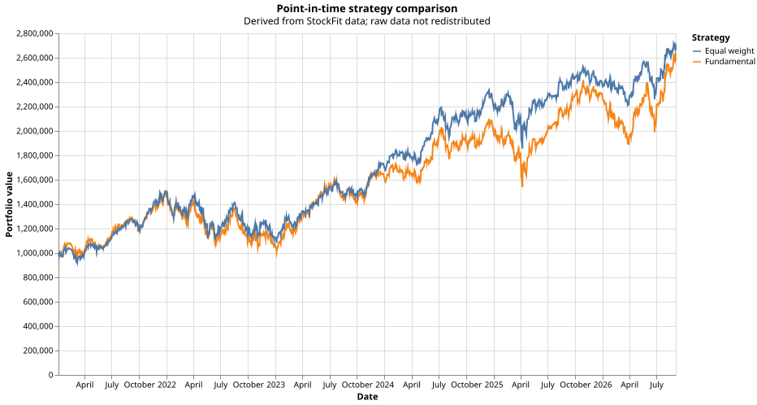
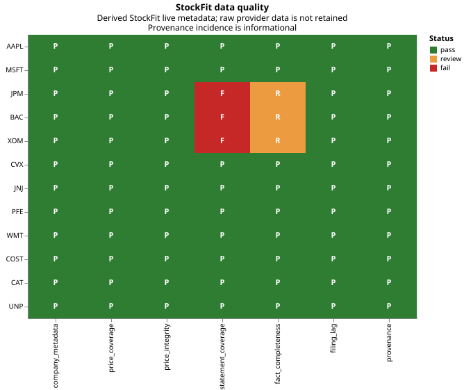

# StockFit point-in-time research case study

**Portfolio draft — not published**

## Overview

I extended `backtest-lib` with a small, testable external-data workflow for
point-in-time fundamental research. It combines adjusted prices with filing-dated
annual revenue and operating-income facts, runs a transparent ranking strategy
against an equal-weight comparator, and audits whether a broader twelve-company
cohort is structurally usable for the same style of research.

The result is an engineering case study rather than an investment claim. The
fundamental rule did not outperform its comparator, and the data audit found
material gaps in three companies. Both outcomes are retained because they make
the research more credible and expose the controls a production process would
need.

## Evidence at a glance

| Evidence | Verified result |
| --- | --- |
| Live price coverage | 1,434 shared observations, 4 January 2021 to 18 September 2026 |
| Backtest cohort | AAPL, MSFT and COST |
| Fundamental rule | Top two eligible securities by year-on-year revenue growth plus operating margin |
| Comparator | Equal weight over the same cohort, dates and decision schedule |
| Fundamental result | 157.80% total return; 0.67 Sharpe; -32.14% maximum drawdown |
| Comparator result | 166.27% total return; 0.82 Sharpe; -27.95% maximum drawdown |
| Data-quality audit | 12 companies; 9 pass, 0 review and 3 fail |
| Trial requests | 36 sequential requests with no retries |
| Regression evidence | 424 passed, 3 skipped and 12 deselected; Ruff and Pyrefly passed |

## Why point-in-time handling matters

A backtest can look into the future accidentally if it uses a financial value
before its filing date or applies a later amendment to earlier decisions. This
integration gates each statement by its original filing date and rolls amended
facts back to the value available on each historical decision date. Missing
inputs make a security ineligible rather than silently filling a value.

The default workflow is offline and uses fixtures explicitly labelled as
invented synthetic data. Live calls require both the `--live` flag and a
process-scoped `STOCKFIT_TOKEN`. Raw provider responses, prices, financial
values and credentials are not retained in the repository.

## Architecture

The example keeps network access, transformation, portfolio logic and reporting
separate:

1. `client.py` performs the three approved HTTP reads and validates status and
   response shape without embedding credentials.
2. `transforms.py` aligns prices, reconstructs facts as of each date and builds
   the library's `MarketView` signals.
3. `strategy.py` contains the top-two fundamental rule and the matched
   equal-weight comparator.
4. `demo.py` runs both portfolios and emits only derived metrics and a NAV
   comparison chart.
5. `audit.py` and `audit_cli.py` apply predeclared coverage, integrity,
   completeness, filing-timing and provenance checks to an expanded cohort.

## Backtest result

The verified live run produced 1,425 completed observations for both strategies
from 4 January 2021 through 4 September 2026. Both portfolios started with
1,000,000 nominal units in cash and rebalanced monthly.

The fundamental portfolio ended at 2,578,038.91, with an annualised return of
18.23%, annualised volatility of 24.19%, a Sharpe ratio of 0.67 and maximum
drawdown of -32.14%. The equal-weight comparator ended at 2,662,720.38, with an
annualised return of 18.91%, annualised volatility of 20.61%, a Sharpe ratio of
0.82 and maximum drawdown of -27.95%.

The comparator finished ahead and had better risk-adjusted metrics. This result
does not support an alpha claim; it demonstrates that the framework can produce
and preserve an unfavourable but informative comparison.

## Data-quality result

Before inspecting outcomes, I fixed a twelve-company cohort spanning technology,
banking, energy, healthcare, consumer and industrial businesses. The audit made
one company, price-history and income-statement request per ticker and evaluated
the responses against predeclared thresholds.

Nine companies passed and three failed. JPM and BAC lacked sufficient operating
income coverage to form a usable consecutive annual pair. XOM returned no annual
rows in the trial request, resulting in short-history, incomplete-fact and
no-usable-pair findings. These are narrow observations about the returned trial
data, not judgements about the companies or securities.

The audit retained only derived metadata. Across the cohort, median revenue and
operating-income completeness were both 100%, while the company-level median
filing lag was 46.5 days. The complete result and fixed thresholds are recorded
in [`data-quality-audit.md`](data-quality-audit.md).

## Verification and reproduction

Unit tests cover authenticated request construction, status and schema failures,
secret redaction, price alignment, filing-date gates, amendment rollback,
missing facts, deterministic ranking, audit thresholds and artefact safety.
End-to-end tests run without network access or credentials and assert that raw
provider fields do not enter published outputs.

At this checkpoint, the repository suite reported 424 passed, 3 skipped and 12
deselected tests. Ruff formatting and linting, Pyrefly type checking, documentation
builds and cross-platform wheel builds also passed in CI.

The offline demonstration and audit remain reproducible from documented commands
in [`README.md`](README.md). Live execution is deliberately opt-in.

## Limitations

- The current-ticker cohorts introduce survivorship and selection bias.
- Three stocks are too few to evaluate a general investment strategy, while
  twelve companies are too few to certify provider-wide data quality.
- The backtest omits costs, spread, slippage, liquidity, taxes and market impact.
- Provider history may be clamped, and adjusted-price history may use a current
  adjustment snapshot.
- One uniform fundamental fact rule is deliberately conservative across sectors,
  particularly banking and energy.
- There was no out-of-sample study, historical universe reconstruction or
  parameter search.

## Engineering takeaway

Data timing and data quality are part of strategy logic, not preprocessing
details. Narrow interfaces and pure transformation functions made awkward cases
such as restatements, missing facts and incomplete sector coverage testable
without live API calls. A matched comparator and predeclared audit thresholds
kept the evidence interpretable even when the outcomes were unfavourable.
