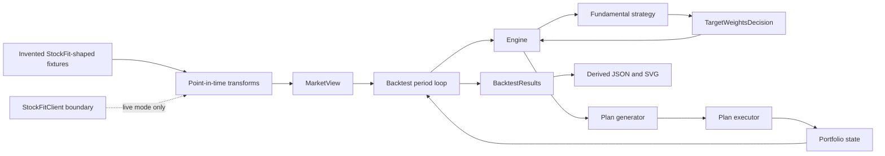
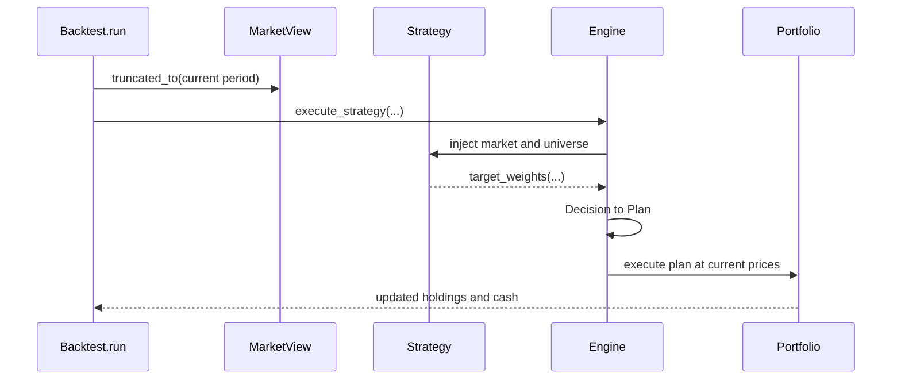
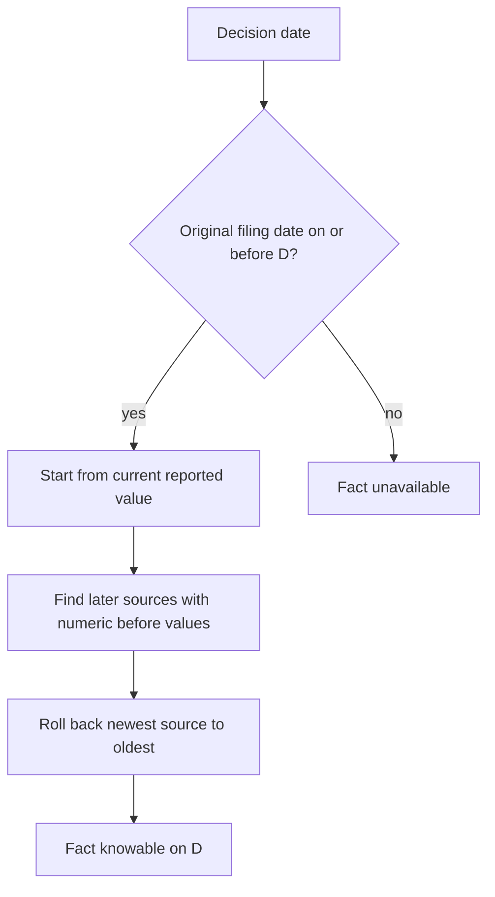
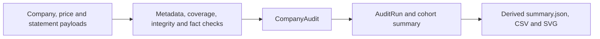

# Manual code-review guide

This guide is a practical route through `backtest-lib` and the StockFit
integration. It is designed for VS Code on Windows, but every command is an
ordinary PowerShell command and can also be run from another IDE terminal.

The review is deliberately offline. It uses invented StockFit-shaped fixtures,
makes no network requests and does not need a StockFit token.

## What you should be able to explain afterwards

By the end, you should be able to:

- describe how `MarketView`, a strategy, a `Decision`, the engine and a
  portfolio fit together;
- trace a filing-dated fact from a fixture into a point-in-time signal;
- explain how the code prevents a later filing from leaking into an earlier
  decision;
- follow one monthly decision through `Backtest.run` into new holdings;
- distinguish raw inputs from the derived outputs that are safe to retain;
- make and verify a small test-first change.

Allow about four hours in total. Each session is independent, so stop at any
checkpoint and return later.

## Session 0: prepare the workspace (20 minutes)

### 1. Build the environment

From the repository root:

```powershell
python --version
uv --version
rustc --version
uv sync --group dev --group docs --frozen
.\.venv\Scripts\python.exe --version
uv run pytest tests/e2e/test_stockfit_demo.py -q
```

The Python version should be 3.12 or newer; the repository CI uses 3.14. The
focused test should pass without reading `STOCKFIT_TOKEN`.

### 2. Install the local VS Code launch configurations

The repository intentionally ignores `.vscode/`, so copy the reviewed example
instead of committing personal editor state:

```powershell
New-Item -ItemType Directory -Force .vscode | Out-Null
Copy-Item docs\stockfit\vscode-launch.example.json .vscode\launch.json
code .
```

In VS Code, run **Python: Select Interpreter** and choose
`.venv\Scripts\python.exe`. Open **Run and Debug** with `Ctrl+Shift+D`. Four
configurations should be available:

- `Debug: StockFit offline demo`;
- `Debug: StockFit offline audit`;
- `Debug: StockFit end-to-end test`;
- `Debug: current pytest file`.

They use `justMyCode: false`, allowing `F11` to step from the example into
`src/backtest_lib`. The module-based configurations also avoid relying on a
hard-coded path to VS Code's internal `debugpy` launcher.

If the debugger itself stalls, first run the equivalent terminal command. A
passing terminal command separates a debugger configuration problem from a
project problem:

```powershell
uv run pytest tests/e2e/test_stockfit_demo.py -q
```

### 3. Generate the offline outputs once

```powershell
uv run python -m examples.stockfit.demo --output-dir artifacts/stockfit-review
uv run python -m examples.stockfit.audit_cli --output-dir artifacts/stockfit-audit-review
```

Inspect the filenames, but do not try to interpret every value yet. The demo
writes a derived summary and NAV chart; the audit writes a derived summary,
company table and quality chart.

**Checkpoint:** You can run tests and both offline commands, and VS Code uses
the repository virtual environment.

## Architecture map

### Components



The dashed client path is not used during this review. Offline fixtures already
have the same narrow shape consumed by the transforms.

### One decision period



The strategy never mutates a portfolio directly. It returns a declarative
decision, which the engine plans and executes.

## Session 1: understand the core library (45 minutes)

Read these files in order:

1. `src/backtest_lib/__init__.py` — public API exports;
2. `src/backtest_lib/market/__init__.py` — `MarketView` and `PastView`;
3. `src/backtest_lib/strategy/__init__.py` — the strategy callable contract;
4. `src/backtest_lib/engine/decision/__init__.py` — decision types and helpers;
5. `src/backtest_lib/portfolio/__init__.py` — holdings, cash and value;
6. `src/backtest_lib/backtest/__init__.py` — orchestration loop.

Keep this mental model while reading:

```python
def strategy(universe, market):
    # Read only the time-fenced view available at this decision.
    return target_weights({security: 1 / len(universe) for security in universe})
```

Parameter names matter. `Engine._parse_strategy_args` inspects the callable and
injects only `universe`, `current_portfolio`, `market` and `ctx`.

### Breakpoints

Use `Debug: StockFit end-to-end test` and set breakpoints at:

- `Backtest.__init__` after the decision schedule is constructed;
- `Backtest.run` at `past_market_view = self.market_view.truncated_to(i)`;
- `Engine.execute_strategy` after `used_kwargs` is created;
- `PerfectWorldPlanGenerator.generate_plan`;
- `PerfectWorldPlanExecutor.execute_plan`.

At each stop, answer:

1. What data can the strategy see?
2. What is the current decision date?
3. Is the strategy returning an action or mutating state?
4. Where does the returned decision become a new portfolio?

**Checkpoint:** You can explain the difference between a strategy, decision,
plan, execution result and portfolio.

## Session 2: trace point-in-time data (60 minutes)

Read:

- `examples/stockfit/client.py`;
- `examples/stockfit/transforms.py`;
- `tests/unit/examples/stockfit/test_transforms.py`.

### Provider boundary

`StockFitClient` is deliberately narrow. It constructs three authenticated GET
requests, validates HTTP and JSON shape, and removes the bearer token from any
provider error message. Tests replace its transport, so validation does not
need a network call.

Run:

```powershell
uv run pytest tests/unit/examples/stockfit/test_client.py -q
```

### Price alignment

`price_frame` validates each observation, sorts by date and retains only dates
shared by every security. It does not forward-fill a missing price.

### Filing gates and rollback



The key idea in `fact_as_of` is:

```python
for _, before in sorted(rollbacks, reverse=True):
    value = before
```

The loop reverses changes filed after the decision date. It applies to any
later source with a numeric `before` value, not only sources labelled as an
amendment.

Set breakpoints at:

- `fact_as_of` after `original_filing_date` is parsed;
- the loop collecting `rollbacks`;
- the reverse-sorted rollback loop;
- `_score_as_of` after `available_indexes` is built;
- `signal_frames` inside the `as_of` loop;
- `build_market` immediately before `btl.MarketView(...)`.

Run the focused transform tests:

```powershell
uv run pytest tests/unit/examples/stockfit/test_transforms.py -q
```

Pause on
`test_fact_as_of_rolls_back_before_value_from_ordinary_later_filing` and
write down the value before and after each rollback.

**Checkpoint:** You can explain why a later restatement cannot change an
earlier decision and why an incomplete fact produces ineligibility rather than
an estimate.

## Session 3: follow strategy to result (60 minutes)

Read:

- `examples/stockfit/strategy.py`;
- `examples/stockfit/demo.py`;
- `tests/unit/examples/stockfit/test_strategy.py`;
- `tests/e2e/test_stockfit_demo.py`.

The fundamental strategy reads the latest score and eligibility rows, ranks
eligible securities by descending score and uses the ticker as a deterministic
tie-break:

```python
ranked = sorted(
    (security for security in universe if eligible[security] == 1),
    key=lambda security: (-score[security], security),
)
```

It returns equal target weights for the first `top_n` securities. If none are
eligible, it returns `hold()`.

Select `Debug: StockFit offline demo` and set breakpoints at:

- `run_demo` after `build_market`;
- `make_fundamental_strategy.strategy` after `ranked` is created;
- `Backtest.run` immediately before `execute_strategy`;
- `Engine.execute_strategy` after the strategy returns;
- `BacktestResults.from_weights_market_initial_capital`;
- `_metrics` in `examples/stockfit/demo.py`.

For the first rebalance, record:

| Question | Your observation |
| --- | --- |
| Which securities are eligible? | |
| What are their scores? | |
| Which two are selected? | |
| What decision object is returned? | |
| What are the resulting holdings and cash? | |

Then compare the fundamental path with `equal_weight_strategy`. Both use the
same cohort, price dates, schedule and starting cash; only the decision rule
differs.

**Checkpoint:** You can trace a score into weights and explain why the backtest
result ending behind the comparator is evidence, not a framework error.

## Session 4: understand the audit and safe outputs (45 minutes)

Read:

- `examples/stockfit/audit.py`;
- `examples/stockfit/audit_cli.py`;
- `tests/unit/examples/stockfit/test_audit.py`;
- `tests/e2e/test_stockfit_audit.py`.



Use `Debug: StockFit offline audit` and stop at:

- `audit_company_metadata`;
- `audit_prices` after dates are normalised;
- `audit_statements` after required facts are counted;
- `combine_company_audit`;
- `summarise_cohort`;
- `publish_artifacts` before the temporary directory is promoted.

Confirm that status is computed from predeclared reason codes and that output
functions consume audit dataclasses rather than raw provider payloads.

Run:

```powershell
uv run pytest tests/unit/examples/stockfit/test_audit.py -q
uv run pytest tests/e2e/test_stockfit_audit.py -q
```

**Checkpoint:** You can explain why a failed company remains visible, how an
incomplete run is labelled, and why retained artefacts cannot reproduce raw
prices or filings.

## Session 5: reversible exercises (30–60 minutes)

Before each exercise, predict the result. Run the smallest relevant test after
the change, then use `git diff` to inspect and revert your experiment.

1. Change one synthetic `dateFiled` value and predict the first eligible date.
2. Change a numeric `before` value and trace each rollback step.
3. Remove `operatingIncome` from one fixture and confirm ineligibility.
4. Change `make_fundamental_strategy(top_n=2)` to `top_n=1` and predict the
   returned target weights.
5. Add a failing test for a malformed price observation, then make the smallest
   implementation change needed to pass it.
6. Add an unknown parameter to a toy strategy and trace the error from
   `Engine._parse_strategy_args`.

Useful focused commands:

```powershell
uv run pytest tests/unit/examples/stockfit/test_transforms.py -q
uv run pytest tests/unit/examples/stockfit/test_strategy.py -q
uv run pytest tests/e2e/test_stockfit_demo.py -q
git diff
```

Revert only your deliberate learning edits. Do not remove other work that may
already be present in the checkout.

## Glossary

| Term | Meaning in this repository |
| --- | --- |
| `MarketView` | Prices, signals and tradability indexed across the full market history |
| `PastView` | A time-aware view used to expose slices by period or security |
| Strategy | Callable that reads injected context and returns a `Decision` |
| `Decision` | Declarative request such as hold, trade or target weights |
| Plan | Engine operations generated from a decision at current prices |
| Executor | Applies plan operations to a portfolio |
| Portfolio | Holdings, cash, universe and total value at a point in the simulation |
| `BacktestResults` | Allocation and value history plus derived performance statistics |
| Point-in-time | Restricting a decision to information knowable on its historical date |

## Final teach-back checklist

Without looking at the diagrams, try to explain:

1. Why does `Backtest.run` pass a truncated `MarketView` to the engine?
2. How are strategy arguments selected?
3. What separates a `Decision` from portfolio mutation?
4. How does `fact_as_of` undo future knowledge?
5. Why does missing fundamental data make a security ineligible?
6. What makes the comparator a fairer baseline?
7. Which outputs are safe to retain, and what is intentionally excluded?

If any answer is unclear, return to the corresponding checkpoint and step
through one test rather than rereading the entire repository.
